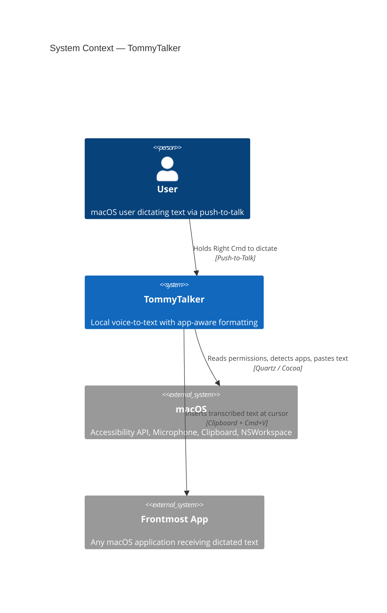
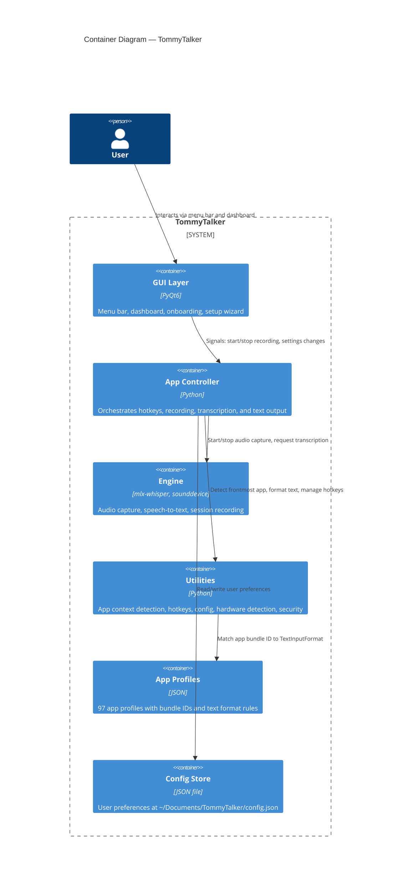
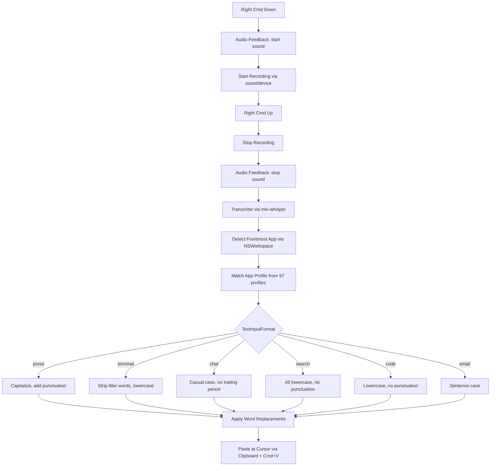
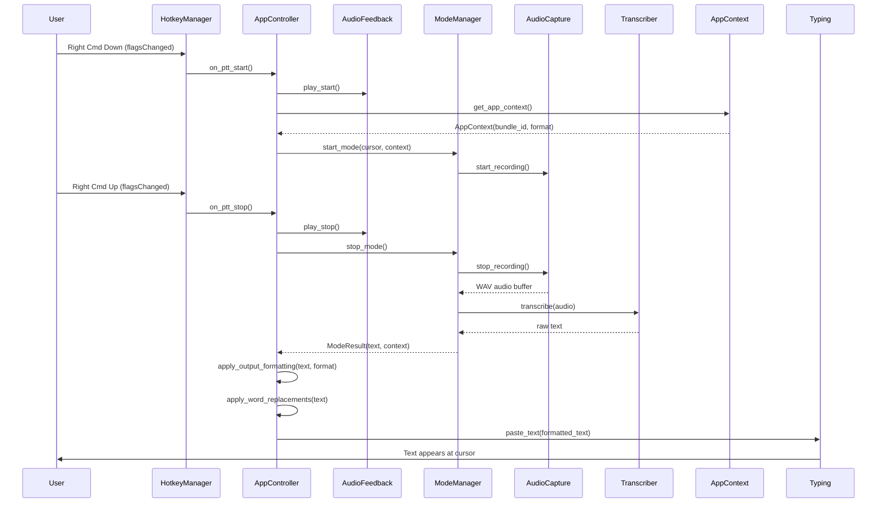

# System Architecture

> Technical architecture documentation for TommyTalker.
> Follows the [C4 Model](https://c4model.com/) with Mermaid.js diagrams.

---

## 1. System Context (C4 Level 1)

TommyTalker is a standalone macOS desktop application. It has no external service dependencies — all processing runs on-device.

---

## 2. Container Architecture (C4 Level 2)

The application is a single-process PyQt6 desktop app with three logical layers.

---

## 3. Key Design Decisions

| Decision | Choice | Why | Alternatives Considered |
|----------|--------|-----|------------------------|
| Speech-to-Text | mlx-whisper | Native Apple Silicon acceleration via MLX/Metal. Best performance on M-series chips. | Whisper.cpp (C++), faster-whisper (ctranslate2) |
| Hotkey System | Quartz Event Tap | Supports modifier-only keys (Right Command). Compatible with Python 3.13+. Carbon is deprecated. | Carbon (deprecated, removed in Python 3.14), pynput (no modifier-only support) |
| App Detection | NSWorkspace + JSON profiles | Data-driven approach: 97 profiles with bundle IDs and regex patterns. Easy to add apps without code changes. Category-based fallback for unknown apps. | Hardcoded app list, per-app plugins |
| GUI Framework | PyQt6 | Mature, cross-platform (macOS focus), supports system tray and native look. | rumps (menu bar only), tkinter (limited) |
| Text Insertion | Clipboard + Cmd+V | Reliable across all macOS apps. Character-by-character typing available as fallback for apps that intercept paste. | AppleScript `keystroke`, CGEvent keyboard simulation |
| Hardware Tiers | 3-tier auto-detection | RAM-based tier selection (< 16 GB / 16–32 GB / > 32 GB) automatically picks the right Whisper model size. | Manual model selection, GPU VRAM-based tiers |
| Audio Feedback | macOS system sounds | Always available, non-blocking via `afplay`, no additional dependencies. | Custom sound files, PyQt6 multimedia |
| App Bundling | PyInstaller + LaunchAgent | PyInstaller creates a self-contained .app. LaunchAgent plist handles start-on-login via standard macOS mechanism. | py2app, manual login items |

---

## 4. Data Flow

The primary push-to-talk flow from key press to text insertion.

---

## 5. Security Posture

| Concern | Approach |
|---------|----------|
| Data in Transit | None — all processing is local. No network calls. |
| Data at Rest | Audio recordings saved as WAV in `~/Documents/TommyTalker/Recordings/`. Config stored as plain JSON. |
| Permissions | Microphone and Accessibility permissions required. Permission gatekeeper in `main.py` blocks launch until granted. |
| Input Validation | AST-based code validator (`code_validator.py`), prompt injection detection (`prompt_injection.py`), filesystem boundary enforcement (`path_guard.py`). |
| Pre-Commit | 9-phase security scanner checks for secrets, PII, hardcoded paths, dangerous code patterns, and private asset exposure. |
| Secrets | No secrets required for default operation. `.env` is gitignored. |

---

## 6. Technology Stack

| Layer | Technology | Purpose |
|-------|-----------|---------|
| Language | Python 3.12+ | Primary implementation |
| GUI | PyQt6 | Menu bar, dashboard, system tray |
| Speech-to-Text | mlx-whisper | Metal-accelerated transcription on Apple Silicon |
| Audio | sounddevice + soundfile | Audio capture and WAV recording |
| Hotkeys | Quartz Event Tap (pyobjc-Quartz) | Modifier-only global hotkey detection |
| App Detection | pyobjc-Cocoa (NSWorkspace) | Frontmost application identification |
| Text Insertion | pyautogui | Clipboard paste and keyboard simulation |
| Hardware Detection | psutil | RAM-based tier auto-detection |
| Packaging | PyInstaller | macOS .app bundle generation |
| Testing | pytest, mutmut | Unit tests (95) and mutation testing |
| CI/CD | GitHub Actions | Lint, test, security scan on push |

---

## 7. Component Interaction

The push-to-talk recording lifecycle, showing signal flow between components.

---

*This document is updated when architectural decisions change.*
